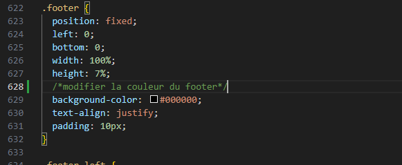
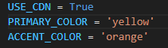
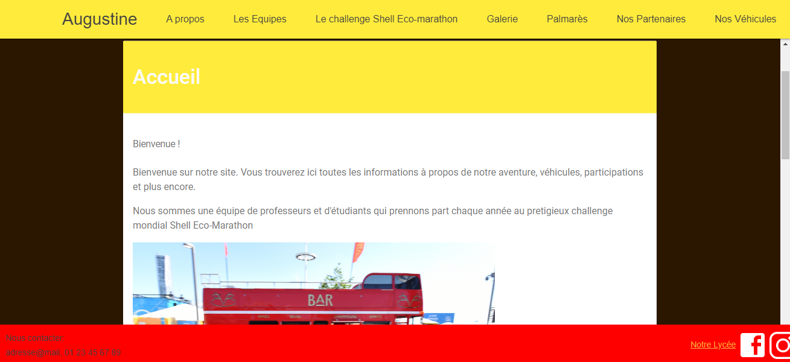

# Création d'une charte graphique
Pour créer une charte graphique il faut d'abord créer un nouveau fichier CSS dans l'onglet "materialistic-pelican/static/css".

Une fois cela fait, on peut récupérer le code déjà généré par le thème pour le copier dans ce nouveau fichier puis modifier les couleurs.

Les emplacements où on peut modifier les couleurs sont dans le fichier charte-1.css à ces lignes précises:

Une fois celà fait il ne reste plus qu'à entrer le nom du fichier à cet endroit dans base.html dans le dossier materialistic-pelican/static/templates

Cependant une fois cela fait le header et les articles ne changeront pas de couleur. 

Malheureusement le thème ne permet pas de modifier la couleur de ces éléments depuis le CSS. Il faut donc passer par le fichier Pelicanconf.py et modifier la variable PRIMARY_COLOR en mettant le nom anglais de la couleur souhaitée comme ci-dessous la couleur yellow

La variable ACCENT_COLOR permet de choisir la couleur des liens cliquables. Par conséquent comme ACCENT_COLOR est réglée sur orange,

Voici donc plusieurs exemples de chartes graphiques réalisables comme celle-ci aux couleurs d'Augustine

Ou bien celle-ci pour un ton plus calme

Ou même celle-ci au couleurs du challenge Eco-Marathon

Pour modifier la couleur du texte dans le footer c'est à cet emplacement juste en dessous du code pour modifier le footer.

Et enfin pour modifier les couleurs des catégories dans le header quand on passe la souris dessus ça se passe ici

